# Deep Learning Enhanced Digital Twin for Advanced Biopsy System (MedTwin Pro)

**Robotic Arm–Based Skin Tumor Detection & Intervention System Using Deep Learning**

**Tagline:** AI-enabled robotic biopsy system — DenseNet121 skin lesion classification, live 3D digital twin, and 4-DoF robotic arm control on a Raspberry Pi 4.

**One-liner:** MedTwin Pro combines a DenseNet121 skin lesion classifier, a real-time Three.js digital twin of a 4-DOF biopsy arm, and low-cost edge hardware into a single web platform — detect the lesion, preview the robot's plan in 3D, and drive the physical arm, all human-in-the-loop.

---

## Team

| Name | Registration No. |
|------|------------------|
| Malik Awais Ur Rehman | FA20-BCE-006/ATK |
| Talha Gohar | FA22-BCE-003/ATK |
| Syed Kamran Abbas | FA22-BCE-008/ATK |

**Supervisor:** Mr. Qazi Zia Ullah
**Co-Supervisor:** Engr. Ahmad Shah
Department of Computer Engineering, COMSATS University Islamabad, Attock Campus, Pakistan

*A thesis submitted in partial fulfillment of the requirements for the degree of Bachelor of Science in Computer Engineering.*


---

## Table of Contents
- [Overview](#overview)
- [Research Questions](#research-questions)
- [Demo & Research Gallery](#demo--research-gallery)
- [System Architecture](#system-architecture)
- [Mathematical Modeling](#mathematical-modeling)
- [Hardware Setup](#hardware-setup)
- [Software Setup](#software-setup)
- [Quick Start](#quick-start)
- [How It Works](#how-it-works)
- [Safety Notice](#safety-notice)
- [Results](#results)
- [UN Sustainability Goals](#un-sustainability-goals)
- [Future Work](#future-work)
- [License](#license)
- [Acknowledgments](#acknowledgments)

---

## Overview

Skin cancer is the most frequent type of cancer worldwide, with roughly 20 million new diagnoses each year, yet timely diagnosis is often delayed by a shortage of dermatologists and the subjective nature of visual lesion assessment. Biopsy — the definitive diagnostic step — depends heavily on specialist skill, which tends to be concentrated in urban centers.

**MedTwin Pro** addresses this gap by integrating:

1. **A DenseNet121 convolutional neural network** trained on the HAM10000 dataset (10,015 dermoscopic images across seven lesion types) for malignant/benign skin lesion classification — achieving **87.6% binary accuracy** with an **AUC of 0.915**.
2. **A physical 4-DOF robotic arm** actuated through a PCA9685 PWM driver over I²C using MG996R metal-gear servos.
3. **A 3D digital twin** built with React, TypeScript, and Three.js that bidirectionally mirrors joint angles, detected lesion location, and classification results over a WebSocket link (~47 ms round-trip).

Everything runs locally on a **Raspberry Pi 4 (4 GB)** — no cloud services, no GPU infrastructure. TensorFlow Lite brings on-device inference down to **100–200 ms** versus 400–600 ms for full Keras, making real-time operation feasible on ARM Cortex-A72 hardware. The platform operates as a *human-in-the-loop* pre-screening apparatus: AI handles lesion detection and targeting, while a remote operator reviews the digital twin and approves or rejects each intervention.

---

## Research Questions

1. Can a real-time 3D digital twin of a robotic biopsy arm run on a Raspberry Pi 4 with synchronization latency below 200 ms?
2. What is the trade-off between inference backends (TensorFlow Lite vs. full Keras) for DenseNet121 classification on an ARM Cortex-A72 CPU?
3. How does domain shift from HAM10000 training data affect accuracy on webcam imagery, and how can it be mitigated?
4. Can ML inference, camera streaming, servo control, and 3D visualization coexist in one stable concurrent system on a single edge device?

---

## Demo & Research Gallery

### Sample Classes

**Benign Tumor Sample**

<div style="margin-bottom: 24px;">
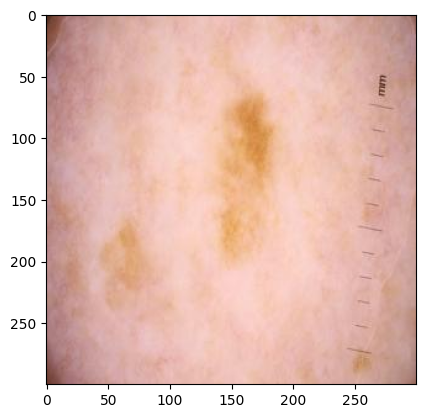
</div>

*This image shows a benign skin tumor sample, as classified by the CNN model. The system demonstrates high accuracy in distinguishing benign lesions from malignant ones.*

**Malignant Tumor Sample**

<div style="margin-bottom: 24px;">
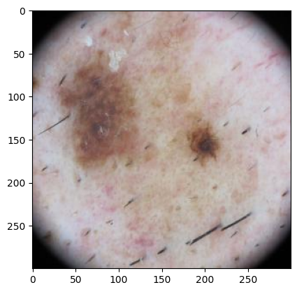
</div>

*This image shows a malignant skin tumor sample, highlighting the model’s diagnostic capability for critical cases.*

### Data / Preprocessing Examples

**Filtered Image**

<div style="margin-bottom: 24px;">

</div>

*Filtered image produced by applying various filters to enhance tumor visibility and reduce background noise.*

**Filtered Image 2 (Highlighted Tumor)**

<div style="margin-bottom: 24px;">

</div>

*Filtered image with the tumor region highlighted, improving segmentation and detection accuracy.*

### Detection

**Lesion Detection with Target Overlay**

<div style="margin-bottom: 24px;">
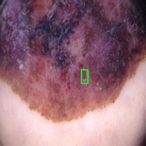
</div>

*Detections exceeding the 0.60 confidence threshold are serialized together with bounding-box coordinates and forwarded to the digital twin update module, where the lesion position is rendered on the Three.js canvas for operator review.*

### Model Evaluation (DenseNet121 — Thesis Results)

All figures below are produced by our trained DenseNet121 model, evaluated exclusively against a 15% reserved HAM10000 holdout subset (2,003 images) with zero data leakage.

**ROC Curve (AUC = 0.915)**

<div style="margin-bottom: 24px;">
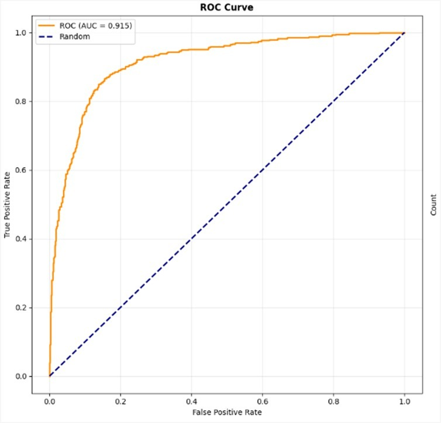
</div>

*Receiver operating characteristic curve for the trained DenseNet121 model. An AUC of 0.915 confirms excellent separability between malignancy and benign conditions across variable confidence thresholds.*

**Binary Confusion Matrix**

<div style="margin-bottom: 24px;">
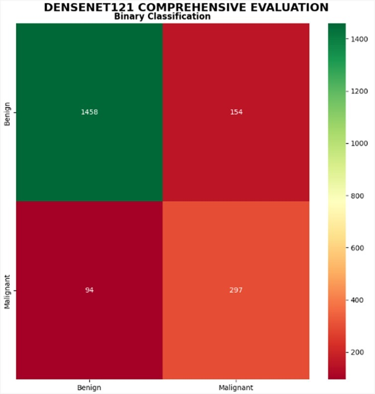
</div>

*Binary classification framework achieving a robust 87.6% accuracy, successfully distinguishing malignant from benign conditions.*

**7-Class Confusion Matrix**

<div style="margin-bottom: 24px;">
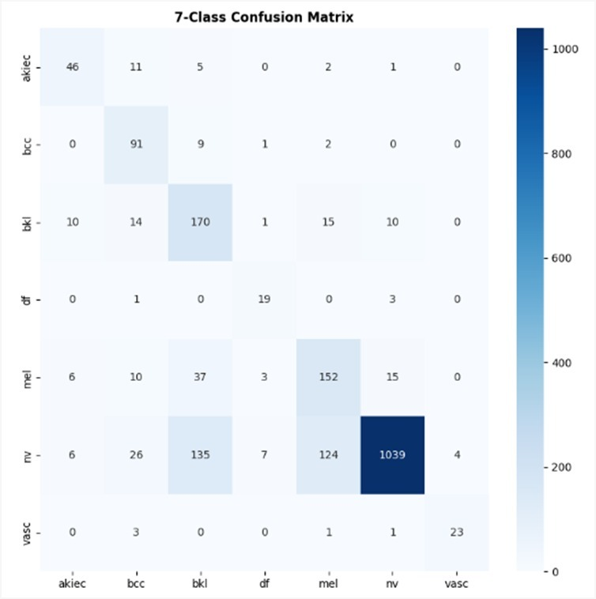
</div>

*Initial seven-class HAM10000 evaluation highlighting the model's struggle with under-represented classes, which necessitated the shift to the binary approach.*

**Performance Metrics**

<div style="margin-bottom: 24px;">
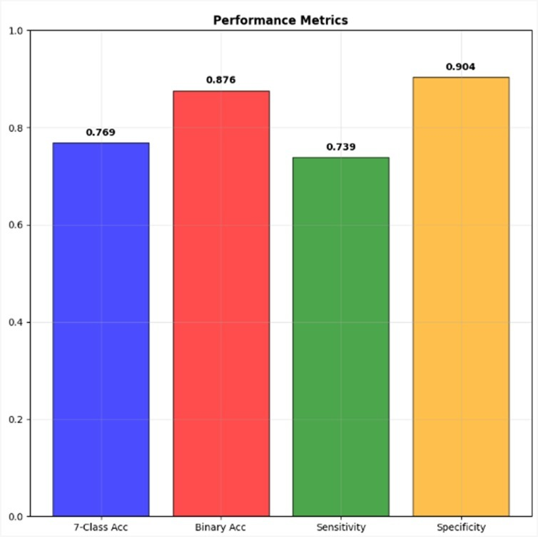
</div>

*Complete diagnostic breakdown: 87.6% binary accuracy, 73.9% malignant sensitivity, 90.4% specificity, and 76.9% seven-class accuracy — validating overall model stability.*

**Key Performance Metrics**

<div style="margin-bottom: 24px;">
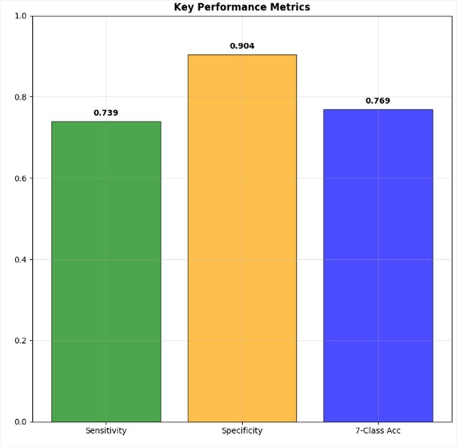
</div>

*Malignant sensitivity of 73.9% against a specificity of 90.4% — the system minimizes false alarms while flagging the majority of dangerous lesions.*

**Cancer Detection Breakdown**

<div style="margin-bottom: 24px;">
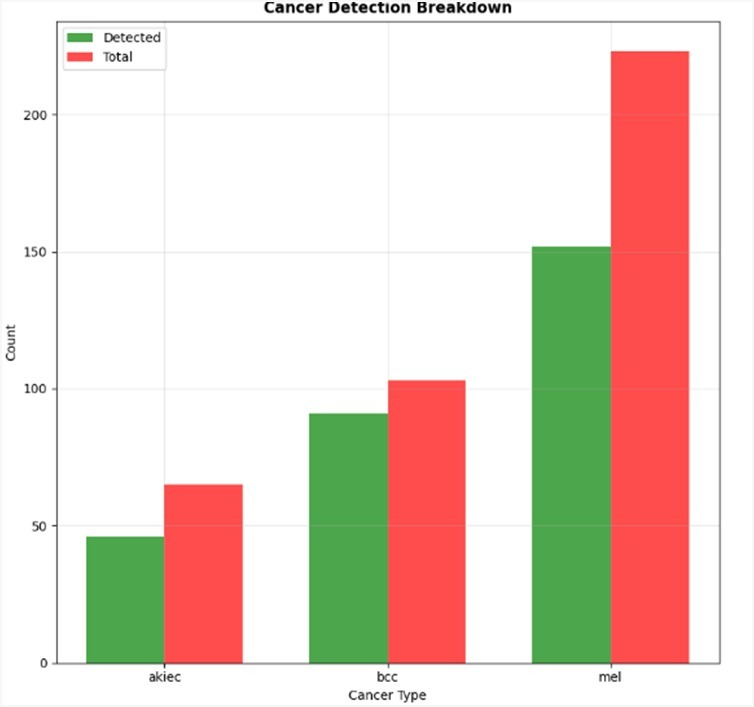
</div>

*Detected versus total counts for malignant cancer types (akiec, bcc, mel). Accurate predictions favor benign nevi due to the training distribution, highlighting a clear need for further augmentation.*

**Model Confidence Analysis**

<div style="margin-bottom: 24px;">
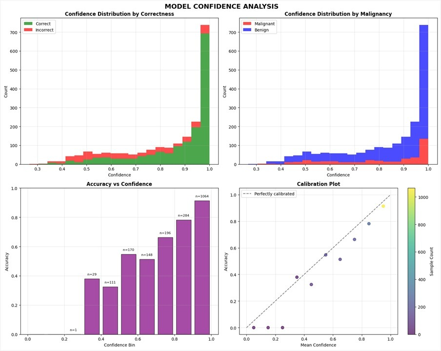
</div>

*Confidence clustering toward ≥ 0.85 proves the model makes classifications with high mathematical certainty — essential for triggering the robotic targeting system safely at our 0.60 threshold.*

### Sample Predictions

<div style="margin-bottom: 24px;">
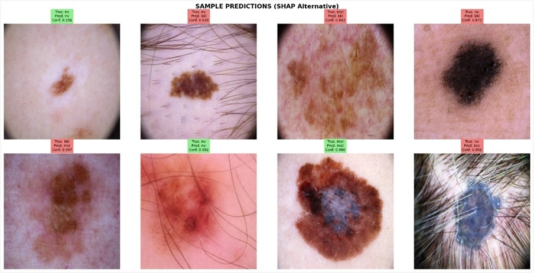
</div>

*Sample predictions with true labels, predicted labels, and confidence scores. The visual mapping validates that the DenseNet121 architecture successfully isolates relevant lesion morphology — such as border irregularity and color asymmetry — rather than relying on background noise artifacts.*

---

## System Architecture

MedTwin Pro uses a cascade architecture combining physical control with digital-twin telemetry feedback.

### Block Diagram

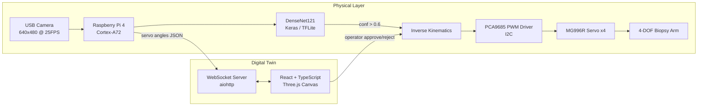

### Workflow / State Machine

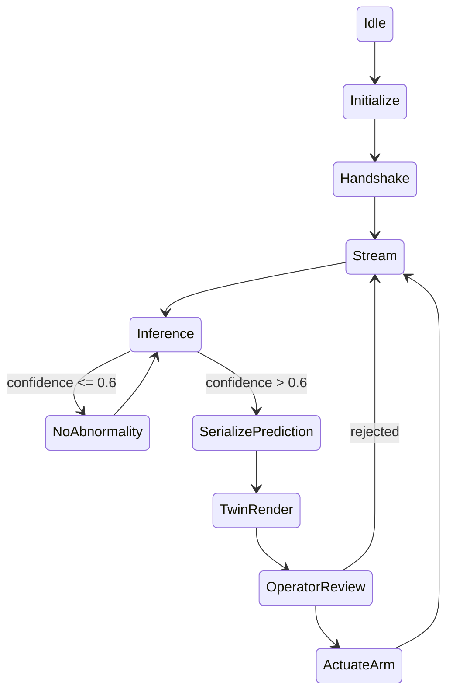

### Data & Model Pipeline

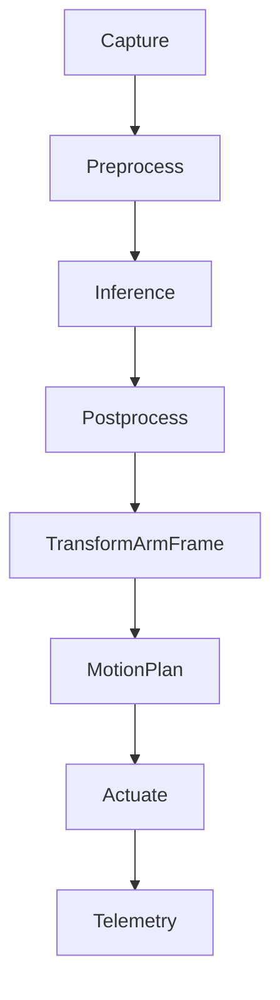

---

## Mathematical Modeling

The manipulator has four degrees of freedom: base yaw, shoulder pitch, elbow pitch, and wrist roll. With link lengths **l₁ = 300 mm, l₂ = 250 mm, l₃ = 160 mm, l₄ = 72 mm**, the end-effector workspace is approximately spherical up to a radius of 300 mm from the mount surface.

**Forward kinematics** map joint angles θ₁–θ₄ to end-effector coordinates (dₓ, d_y, d_z):

$$d_x = \cos(\theta_1)\left[l_2\cos(\theta_2) + l_3\cos(\theta_2+\theta_3)\right] + l_4\cos(\theta_1)\cos(\theta_2+\theta_3+\theta_4)$$

$$d_y = \sin(\theta_1)\left[l_2\cos(\theta_2) + l_3\cos(\theta_2+\theta_3)\right] + l_4\sin(\theta_1)\cos(\theta_2+\theta_3+\theta_4)$$

$$d_z = l_1 + l_2\sin(\theta_2) + l_3\sin(\theta_2+\theta_3) + l_4\sin(\theta_2+\theta_3+\theta_4)$$

These equations are evaluated in **JavaScript** on the frontend to animate the digital twin and in **Python** on the backend to solve inverse kinematics for the target lesion coordinates.

---

## Hardware Setup

### Bill of Materials

| Component | Specs | Role |
|-----------|-------|------|
| Raspberry Pi 4 Model B (4 GB) | Broadcom BCM2711, Quad-core Cortex-A72 (ARM v8) 64-bit SoC | Edge control computer |
| PCA9685 PWM Driver | 16-channel, 12-bit resolution, I²C | Low-jitter servo control |
| MG996R Servo Motors ×4 | Metal gear, ~10 kg/cm stall torque | Base yaw, shoulder, elbow, wrist |
| Standard USB Webcam | 640×480 @ 25 FPS | Lesion capture |
| 4-DOF Robotic Arm | Custom links (300/250/160/72 mm) | Biopsy positioning |

> **Component notes:** The PCA9685 offloads PWM generation to minimize clock jitter. MG996R servos are durable and affordable but open-loop, limiting positional precision to within 1–2°. The webcam resolution was chosen deliberately to keep MJPEG compression throughput within standard 802.11n Wi-Fi bandwidth at a fluid 25 FPS.

### Wiring

| Pi Pin | PCA9685 | Notes |
|--------|---------|-------|
| SDA (GPIO 2) | SDA | I²C data |
| SCL (GPIO 3) | SCL | I²C clock |
| 3.3V | VCC | Logic supply |
| GND | GND | Common ground |
| — | V+ terminal | External 5–6V servo supply |

> **Warning**: Handle the arm and surrounding equipment with care. Pinch points present near joints. Bench demonstration only — not for clinical use.

---

## Software Setup

### Prerequisites
- Python 3.11+ (3.13 works with ML running in simulation mode — see `requirements.txt`)
- Node.js (for the React/TypeScript digital-twin frontend)

### Install Dependencies
```bash
python -m venv venv
source venv/bin/activate        # Windows: venv\Scripts\activate
pip install -r requirements.txt
```

Core stack: `numpy`, `opencv-python`, `Pillow`, `adafruit-circuitpython-pca9685`, `adafruit-circuitpython-servokit`, `smbus2`, `PyYAML`, `aiohttp`, `pydantic`.

For on-device ML inference (Raspberry Pi / Python 3.11):
```bash
pip install tensorflow tflite-runtime
```

### Frontend
```bash
cd full-code-app/twin-touch-biopsy-frontend
npm install
```

---

## Quick Start

### One Command (Raspberry Pi)
```bash
./scripts/setup_env.sh           # first-time environment setup
./scripts/start_medtwin.sh       # start backend (TFLite by default)
./scripts/stop_medtwin.sh        # stop everything
```

**Startup flags:**
| Flag | Description |
|------|-------------|
| `--keras` | Use full Keras model instead of TFLite |
| `--dev` | Development mode (no hardware required) |
| `--frontend` | Also launch the React dev server |
| `--no-arm` | Disable servo output |
| `--no-camera` | Disable camera capture |

### Manual Backend
```bash
python src/unified_server.py --model tflite
```

### Manual Frontend
```bash
cd full-code-app/twin-touch-biopsy-frontend
npm run dev -- --host
```

### Services
| Service | Endpoint |
|---------|----------|
| WebSocket (arm telemetry) | `ws://raspberrypi.local:8765` |
| HTTP API | `http://raspberrypi.local:5000` |
| MJPEG camera stream | `http://raspberrypi.local:8080/stream.mjpg` |
| Digital twin dashboard | `http://raspberrypi.local:5173` |

Open the dashboard from any browser on the same network — no installation needed on the client side.

---

## How It Works

1. **Startup:** `start_medtwin.sh` launches three services in parallel — the camera stream server, the ML WebSocket broadcaster, and (optionally) the frontend dev server.
2. **Streaming:** The remote client connects over WebSocket to the Pi and receives a live MJPEG video feed alongside the synchronized Three.js digital twin.
3. **Inference loop:** Every 400–600 ms the current frame is analyzed by DenseNet121. Frames scoring above the 0.60 confidence threshold trigger prediction serialization.
4. **Targeting:** Detected lesion coordinates are passed through inverse kinematics to compute servo angles (θ₁–θ₄).
5. **Human-in-the-loop review:** The operator inspects the digital twin preview and either approves the auto-generated target coordinates or rejects them.
6. **Actuation:** Approved angles are dispatched over I²C to the PCA9685, which drives the four MG996R servos. Live servo telemetry flows back to the browser, keeping the 3D twin synchronized within a ~50 ms margin.

---

## Safety Notice

> **Warning**: This system is a research prototype for demonstration purposes only. It is **not** a medical device and is **not** approved for clinical or diagnostic use on humans. All imagery shown derives from public research datasets (HAM10000). Follow institutional ethics guidelines when extending this work.

---

## Results

Evaluated on a 15% reserved HAM10000 holdout subset (2,003 images) with zero data leakage:

| Metric | Value |
|--------|-------|
| Binary accuracy (malignant vs benign) | **87.6%** |
| ROC-AUC | **0.915** |
| Malignant sensitivity | 73.9% |
| Specificity | 90.4% |
| TFLite inference latency | 100–200 ms |
| Full Keras inference latency | 427–525 ms |
| WebSocket round-trip latency (500 cycles) | ~47 ms avg |
| Confidence threshold for robotic targeting | 0.60 |

**Interpretation:** An AUC of 0.915 indicates excellent separability between malignancy and benign conditions across thresholds, and confidence clustering toward ≥ 0.85 shows classifications made with high certainty — essential for safely gating the robotic targeting system at the 0.60 threshold. The gap between sensitivity and specificity reflects class imbalance in the training distribution and motivates the augmentation work outlined in Future Work.

Inference logs record timestamps, labels, confidences, and per-frame latency for later analysis.

---

## UN Sustainability Goals

- **SDG 3 — Good Health and Wellbeing:** Democratizes access to expert-level diagnostic tools by pairing inexpensive edge computing with tele-robotic intervention, shortening diagnostic delays in underserved and rural areas.
- **SDG 9 — Industry, Innovation and Infrastructure:** Demonstrates a novel integration of deep learning, the Internet of Medical Things (IoMT), and digital twins within health infrastructure.

---

## Future Work

- **Dataset expansion** via SMOTE and generative models to lift the 73.9% malignant sensitivity.
- **Closed-loop motion control** by replacing open-loop MG996R servos with encodered stepper motors, mitigating current ~1.6° positional drift.
- **Secure transport:** migrating localized protocols onto an end-to-end TLS-encrypted WebRTC tunnel to satisfy patient-data protection mandates.
- **Domain-shift mitigation** for real-world webcam imagery beyond dermoscopic conditions.

---

## Contributing

Issues and pull requests are welcome. Please keep changes consistent with the existing module layout (`src/detection`, `src/hardware`, `src/server`, `src/streaming`) and include tests where practical.

---

## License

This project is licensed under the MIT License.


---

## Acknowledgments

We are grateful to our supervisor **Mr. Qazi Zia Ullah** and co-supervisor **Engr. Ahmad Shah** for their guidance throughout this project, and to the administration and faculty of **COMSATS University Islamabad, Attock Campus** for providing the environment that made this work possible.

Dataset: [HAM10000](https://dataverse.harvard.edu/dataset.xhtml?persistentId=doi:10.7910/DVN/DBW86T) — Tschandl, Rosendahl & Kittler, *Scientific Data* 5, 2018.
