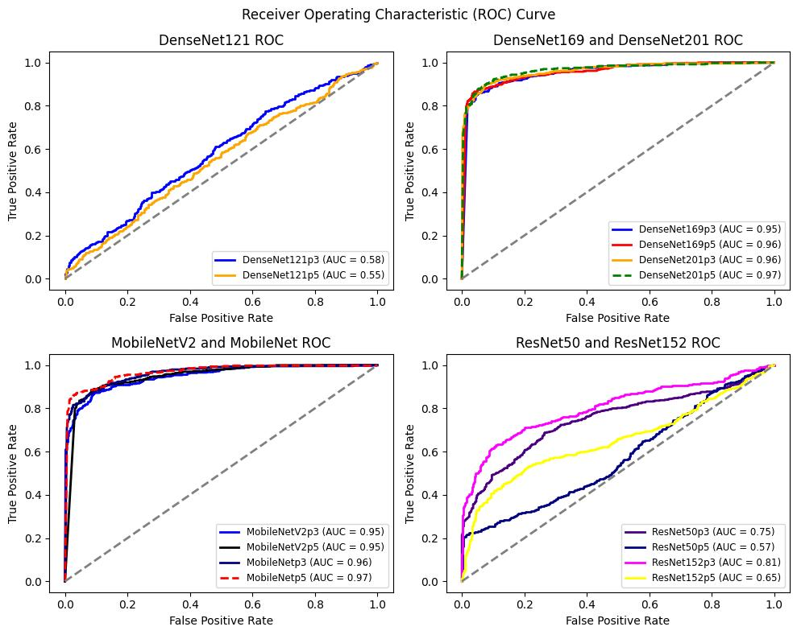
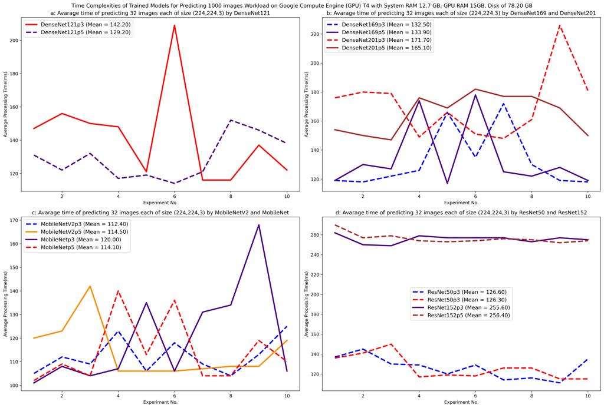
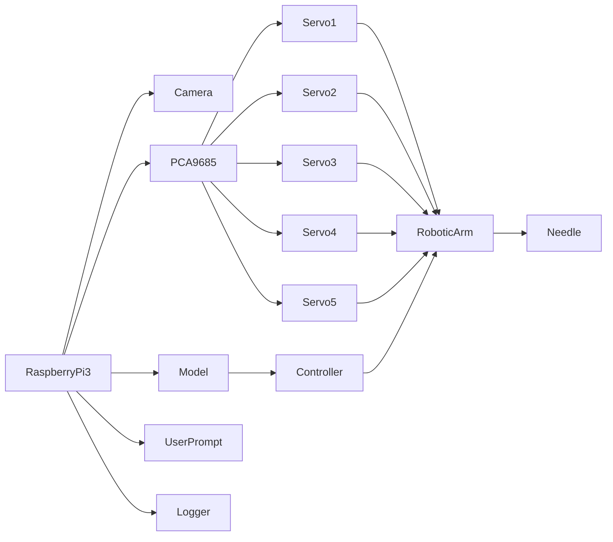
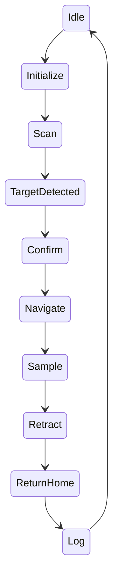
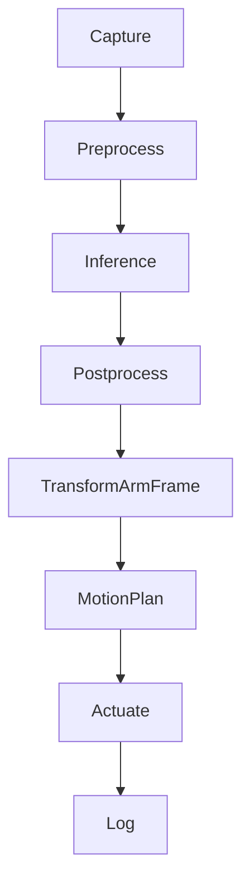

# Robotic Arm–Based Skin Tumor Detection & Intervention Using Computer Vision

**Tagline:** 5-DoF robotic sampling system with real-time tumor detection, coordinate extraction, and guided needle sampling.

**One-liner:** End-to-end pipeline on Raspberry Pi 4 that detects visible skin tumors, draws a bounding box, extracts pixel/world coordinates, and drives a 5-DoF arm with a surgical needle to take a sample—returning safely to home.

> 📄 **Full Thesis Report (COMSATS University Islamabad):** [Project_Thesis_Report_Template___COMSATS_University_Islamabad_Attock_Campus.docx](Project_Thesis_Report_Template___COMSATS_University_Islamabad_Attock_Campus.docx) — complete design, methodology, evaluation, and results documentation.

---

**Features:**
- Real-time skin tumor detection (CNN, strictly OpenCV & TFLite Runtime)
- Pixel/world coordinate extraction for targeting
- Automated 5-DoF arm control with surgical needle
- User consent prompt before sampling
- Safe homing and logging of results
- Modular hardware/software stack for bench demonstration


---

## Table of Contents
- [Quick Links](#quick-links)
- [Overview](#overview)
- [Demo & Research Gallery](#demo--research-gallery)
- [Features](#features)
- [Architecture](#architecture)
- [Hardware Setup](#hardware-setup)
- [Software Setup](#software-setup)
- [Quick Start](#quick-start)
- [How It Works](#how-it-works)
- [Calibration](#calibration)
- [Safety & Regulatory Notice](#safety--regulatory-notice)
- [Evaluation](#evaluation)
- [Results Logging](#results-logging)
- [Troubleshooting](#troubleshooting)
- [Roadmap](#roadmap)
- [Contributing](#contributing)
- [License](#license)
- [Acknowledgments](#acknowledgments)

---

## Quick Links
- 📄 [Full Thesis Report](Project_Thesis_Report_Template___COMSATS_University_Islamabad_Attock_Campus.docx)
- [Notebooks](notebooks/)
- [Source Code](src/)
- [Results Gallery](Results/)
- [Configuration](config/)
- [Scripts](scripts/)
- [Tests](tests/)
- [Issues](../../issues)

---

## Overview
This repository presents a complete, open-source pipeline for robotic skin tumor detection and intervention. Designed for bench demonstration, the system integrates computer vision (CNN-based) with a 5-DoF robotic arm, enabling real-time detection, coordinate extraction, and guided needle sampling. The platform runs on Raspberry Pi 3, leveraging affordable hardware and open-source libraries for reproducibility.

**Arm Kinematics & Control:**
The 5-DoF arm is actuated via MG669R servos controlled by a PCA9685 PWM driver. Inverse kinematics and motion planning are handled in Python, with soft limits and homing routines for safety. The end-effector mounts a surgical needle for sampling.

**Computer Vision & CNN:**
The system uses a dedicated TFLite inference engine coupled with a multi-threaded MJPEG streaming server. A camera module captures frames, which are processed by the CNN for classification. The results (labels, confidence scores, and bounding boxes) are drawn directly onto the frames using OpenCV. This augmented stream is then served over HTTP (port 8080) for real-time visualization in the web dashboard.

---

## Demo & Research Gallery

### Sample Classes

**Benign Tumor Sample**

<div style="margin-bottom: 24px;">

</div>

*This image shows a benign skin tumor sample, as classified by the CNN model. The system demonstrates high accuracy in distinguishing benign lesions from malignant ones.*

**Malignant Tumor Sample**

<div style="margin-bottom: 24px;">

</div>

*This image shows a malignant skin tumor sample, highlighting the model’s diagnostic capability for critical cases.*

### Data / Preprocessing Examples

**Filtered Image**

<div style="margin-bottom: 24px;">

</div>

*Filtered image produced by applying various filters to enhance tumor visibility and reduce background noise.*

**Filtered Image 2 (Highlighted Tumor)**

<div style="margin-bottom: 24px;">

</div>

*Filtered image with the tumor region highlighted, improving segmentation and detection accuracy.*

### Detection

**Tumor Detection with Bounding Box**

<div style="margin-bottom: 24px;">

</div>

*The system detects visible skin tumors in real time, drawing a bounding box around the detected region. The coordinates extracted from the bounding box are used to guide the robotic arm for targeted intervention.*

### Model Search & Evaluation

**ROC Curves of Multiple Models**

<div style="margin-bottom: 24px;">

</div>

*ROC curves comparing Densenet121, DenseNet169, DenseNet201, MobileNet V2, MobileNet, MobileNet50, and ResNet152. These curves illustrate the trade-off between sensitivity and specificity for each model, helping select the best architecture for skin tumor detection.*

**Space Complexity of Trained Models**

<div style="margin-bottom: 24px;">

</div>

*Space complexity analysis for all trained models (Densenet121, DenseNet169, DenseNet201, MobileNet V2, MobileNet, ResNet50, ResNet152), ensuring efficient deployment on edge devices like Raspberry Pi.*

**Specificity Rate vs Sensitivity Rate (2 Models)**

<div style="margin-bottom: 24px;">

</div>

*Specificity rate vs sensitivity rate for two models on test data, demonstrating robust performance in clinical scenarios.*

**Specificity vs Sensitivity (3 Models)**

<div style="margin-bottom: 24px;">

</div>

*Comparison of specificity and sensitivity for three models, providing further insight into model selection and reliability.*

**Histogram of All Trained Models**

<div style="margin-bottom: 24px;">

</div>

*Histogram of pixel intensities for all trained models, used for thresholding and segmentation in the preprocessing pipeline.*

### Performance Metrics

**Accuracy vs Validation Accuracy**

<div style="margin-bottom: 24px;">

</div>

*Training and validation accuracy curves demonstrate the model’s learning progress and generalization capability.*

**Loss vs Validation Loss**

<div style="margin-bottom: 24px;">

</div>

*Loss curves for both training and validation sets, indicating convergence and overfitting checks.*

**Confusion Matrix**

<div style="margin-bottom: 24px;">

</div>

*Confusion matrix visualizing true/false positives and negatives for benign and malignant classes.*

**Classification Report**

<div style="margin-bottom: 24px;">

</div>

*Detailed classification report including precision, recall, F1-score, and support for each class.*

### Error Analysis

**False Positive Example**

<div style="margin-bottom: 24px;">

</div>

*Example of a false positive detection, where a non-tumor region was incorrectly identified as a tumor.*

**False Negative Example**

<div style="margin-bottom: 24px;">

</div>

*Example of a false negative, where a tumor was missed by the detection algorithm.*

---

## Features
- Real-time tumor detection (OpenCV + TFLite Runtime)
- Bounding box and coordinate extraction
- User consent prompt for sampling
- Automated arm movement and needle sampling
- Safe homing and error handling
- Results logging (CSV/JSON)
- Modular hardware/software design

---

## Architecture
### System / Block Diagram


### Workflow / State Machine


### Data & Model Pipeline


---

## Hardware Setup
### Bill of Materials
| Component | Specs | Link |
|-----------|-------|------|
| 5-DoF Robotic Arm | Custom, bench demo | - |
| Servo Motor (MG669R) x5 | 6V, 10kg-cm, 0.16s/60° | [MG669R](https://www.servodatabase.com/servo/mg669r) |
| PCA9685 Servo Driver | 16-channel, I2C, 12-bit | [PCA9685](https://www.adafruit.com/product/815) |
| Raspberry Pi 3 | Raspbian OS | [Raspberry Pi 3](https://www.raspberrypi.com/products/raspberry-pi-3-model-b/) |
| Camera Module | CSI interface | [Pi Camera](https://www.raspberrypi.com/products/camera-module-v2/) |
| Surgical Needle | End-effector | - |
| Test Bed / Fixture | Stable mount | - |
| Skin Tumor Samples | Bench demo only | - |

### Wiring / Pin Map
| Pi Pin | PCA9685 | Servo Channel | Camera | Power |
|--------|---------|---------------|--------|-------|
| SDA    | SDA     | -             | -      | 6V rail |
| SCL    | SCL     | -             | -      | 6V rail |
| 3.3V   | VCC     | -             | -      | - |
| GND    | GND     | -             | -      | - |
| PWM0-4 | -       | S1-S5         | -      | - |
| CSI    | -       | -             | Camera | - |

> **Warning**: Handle needle and servos with care. Pinch points and sharp objects present. Not for clinical use.

---

## Software Setup
### Python Environment
- Python 3.10+
- Recommended: `conda` or `venv`

### Install Dependencies
```bash
pip install tflite-runtime opencv-python opencv-contrib-python numpy scipy pandas scikit-learn matplotlib seaborn adafruit-circuitpython-pca9685 RPi.GPIO gpiozero tqdm pyyaml imutils
```
*(Note: TensorFlow, Keras, and PIL have been removed for lightweight edge deployment on Raspberry Pi).*

### Jupyter Notebook
```bash
pip install notebook
jupyter notebook
```

---

## Quick Start
### Notebook
1. Open `notebooks/` in Jupyter.
2. Run all cells for detection, coordinate extraction, and arm actuation.

### CLI (Standalone Detection & Streaming)
To launch the AI inference engine and start the MJPEG streaming server (port 8080):
```bash
python src/detection/tumor_detector.py
```

### CLI (Web Dashboard)
To launch the React-based intervention dashboard (port 5173):
```bash
cd full-code-app/twin-touch-biopsy-frontend
npm run dev
```

### CLI Flags
| Flag | Description |
|------|-------------|
| --model | Path to trained model weights |
| --camera | Camera index (default: 0) |
| --arm-config | Arm configuration YAML |
| --i2c | I2C address for PCA9685 |
| --servo-channels | List of servo channels |
| --speed-limit | Max servo speed |
| --home-angles | Homing angles for arm |

---

## How It Works
- **Detection & Streaming:** `tumor_detector.py` runs a multi-threaded pipeline. One thread captures and processes frames via TFLite, while another serves an MJPEG stream on port 8080. AI labels (MALIGNANT, BENIGN, UNCERTAIN) are baked directly into the video.
- **Frontend Integration:** The React dashboard consumes the MJPEG stream from `http://localhost:8080/stream.mjpg`, providing a unified interface for observation and robotic control.
- **Coordinate Extraction:** Centroid and bounding box coordinates mapped to arm workspace using pixel/mm scaling or homography. Calibration via ruler method.
- **Motion Control:** PCA9685 pulse width mapped to servo angles; 5-DoF kinematics; soft limits and homing routines for safety.

---

## Calibration
- **Camera:** Intrinsics/extrinsics via ruler or checkerboard.
- **Arm:** Homing angles, zero offsets, per-servo min/max pulses, needle alignment.

### Calibration Checklist
- [x] Camera calibrated (pixel/mm)
- [x] Arm homed and zeroed
- [x] Servo limits set
- [x] Needle aligned
- [x] Test-bed stable

---

## Safety & Regulatory Notice
> **Warning**: This system is for R&D demonstration only. Not for medical or clinical use. Handle needles and samples with biohazard precautions. Obtain consent for all human data. Follow local ethics guidelines.

---

## Evaluation
| Metric | Value/Image |
|--------|-------------|
| Accuracy |  |
| Loss |  |
| ROC-AUC |  |
| Confusion Matrix |  |
| Classification Report |  |
| Specificity/Sensitivity |  |

**Interpretation:**
Confusion matrix and ROC curve show strong separation between benign and malignant classes. Specificity and sensitivity are balanced for robust detection.

---

## Results Logging
Inference results are automatically saved to `logs/detections.csv`.

| Field | Type | Description |
|-------|------|-------------|
| timestamp | str | Datetime of inference |
| label | str | MALIGNANT, BENIGN, or UNCERTAIN |
| confidence | float | Model confidence percentage |
| inference_ms | float | Time taken for single frame (ms) |

**Example Log (CSV):**
```csv
timestamp,label,confidence,inference_ms
2025-08-20 12:34:56,MALIGNANT,0.9234,45.2
```

*(Extended system logs also record full arm coordinates and sampling details in the main app logs).*

---

## Troubleshooting
| Symptom | Possible Cause | Fix |
|---------|---------------|-----|
| Detection not triggering | Lighting, camera misaligned | Adjust lighting, check camera mount |
| Bounding box jitter | Model confidence low | Retrain, smooth output |
| Servo not moving | Wiring, power, code | Check connections, power rails, code |
| I2C not found | Address, wiring | Verify I2C address, check SDA/SCL |
| Camera not detected | Driver, cable | Reinstall driver, check CSI cable |
| Homing fails | Servo limits, code | Reset limits, debug code |
| Power brownout | Overload | Use stable 6V supply |

---

## Roadmap
- Improved calibration routines
- Advanced path planning
- Force feedback and torque limits
- Expanded dataset and augmentation
- Model quantization for edge deployment

---

## Contributing
We welcome issues and pull requests! Please follow:
- Code style: [black](https://github.com/psf/black), [isort](https://github.com/PyCQA/isort)
- Conventional commits
- PR checklist: lint, test, docs
- Run `black . && isort .` before submitting

---

## License
This project is licensed under the [MIT License](LICENSE).


---

## Acknowledgments
Special thanks to all collaborators, open-source contributors, and data providers.
